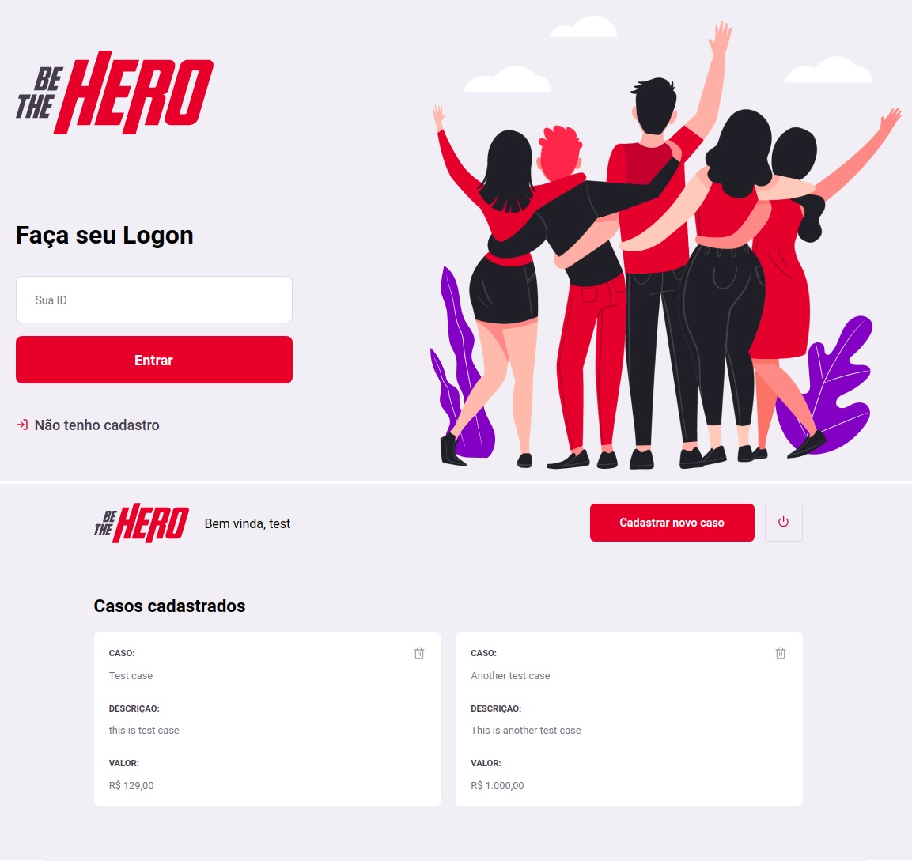
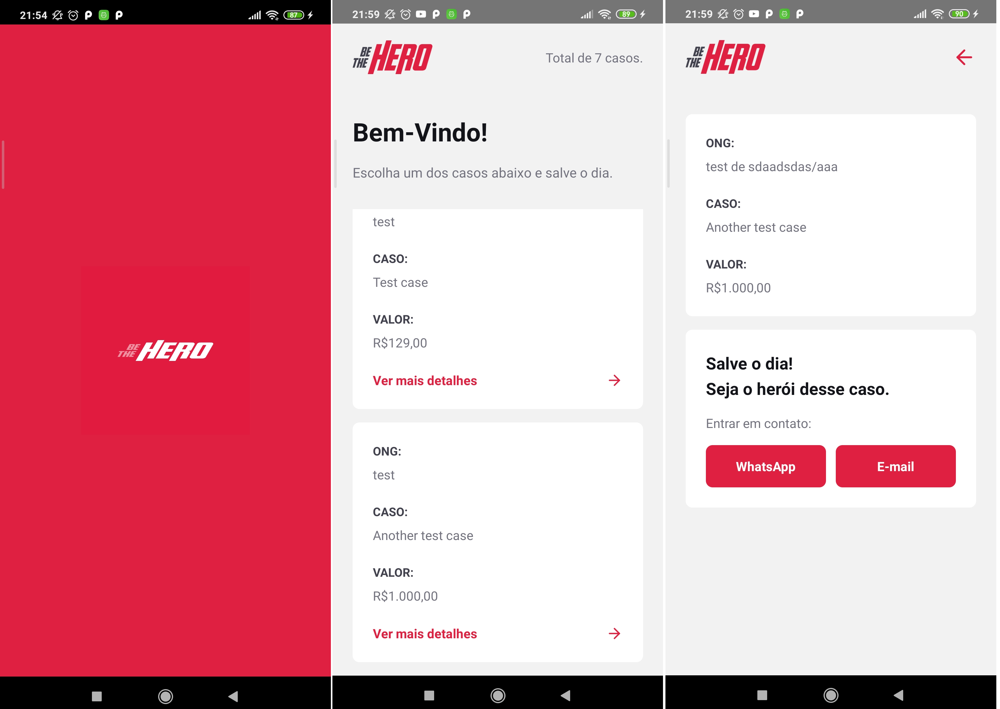

<h1 align="center">
    Be The Hero
</h1>

  

  

  

  

  <a href="#rocket-technologies">Technologies</a>&nbsp;&nbsp;&nbsp;|&nbsp;&nbsp;&nbsp;
  <a href="#-project">Project</a>&nbsp;&nbsp;&nbsp;|&nbsp;&nbsp;&nbsp;
  <a href="#-how-to-contribute">How to contribute</a>&nbsp;&nbsp;&nbsp;|&nbsp;&nbsp;&nbsp;
  <a href="#memo-license">License</a>

 

  <h4 align="center">Web</h4>
  

  <h4 align="center">Mobile</h4>
  

## :rocket: Technologies

This project was developed with the following technologies:

- [Node.js](https://nodejs.org/en/)
- [React](https://reactjs.org)
- [React Native](https://facebook.github.io/react-native/)
- [React-cli](https://github.com/react-native-community/cli)

## 💻 Project

BeTheHero is a project that aims to facilitate donations to NGOs.

Through a web interface, NGOs can register new cases and through the mobile app, users who wish to send a donation can do so by contacting them via email or WhatsApp.

## 🤔 How to contribute

- Fork this repository;
- Create a branch with your feature: `git checkout -b my-feature`;
- Commit your changes: `git commit -m 'feat: My new feature'`;
- Push to your branch: `git push origin my-feature`.

Once your pull request merge is done, you can delete your branch.

## :memo: License

This project is under the MIT license. See [LICENSE](LICENSE) file for more details.
